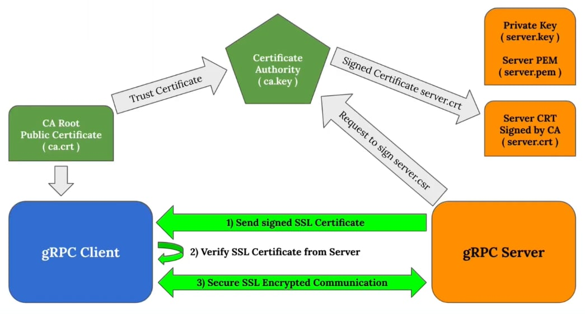

## Go-gRPC

### Protocol Buffers: Tags

- In Protocol Buffers, **field names are not important** at runtime.
  (But when you're programming, the field names *do* matter for readability.)
- The important element for protobuf is the **TAG** (the field number).
- Smallest tag: **1**
- Largest tag: **536,870,911** — i.e. `(2^29) - 1`
- You **cannot** use the numbers **19000–19999** (reserved for internal use).

### Rules for Updating a Protocol

- **Don't change** the numeric tags of any existing fields.
- You **can add new fields** — old code will simply ignore them.
- Fields **can be removed**, as long as the tag number is **not reused** in the updated message type.
  - Tip: consider renaming the field instead (e.g. `OBSOLETE_fieldname`) so future users of your `.proto` can't accidentally reuse that number.
- For **data type changes** (e.g. `int32` → `int64`), please refer to the official documentation, since not all conversions are safe.

### Integer Types

- `uint32`, `uint64` — do **not** allow negative values.
- `int32`, `int64` — do not encode negative values efficiently.
- `sint32`, `sint64` — encode negative values well (using a technique called **ZigZag**).

---

## Go-gRPC (ภาษาไทย)

### Protocol Buffers: แท็ก (Tags)

- ใน Protocol Buffers **ชื่อของฟิลด์ไม่สำคัญ** ในตอนรันโปรแกรม
  (แต่ตอนเขียนโค้ด ชื่อฟิลด์ *มีผล* ต่อความอ่านง่ายของโค้ด)
- สิ่งที่สำคัญจริงๆ สำหรับ protobuf คือ **TAG** (หมายเลขประจำฟิลด์)
- แท็กที่เล็กที่สุด: **1**
- แท็กที่ใหญ่ที่สุด: **536,870,911** หรือ `(2^29) - 1`
- **ห้ามใช้** หมายเลข **19000–19999** (ถูกสงวนไว้สำหรับการใช้งานภายใน)

### กฎการอัปเดต Protocol

- **ห้ามเปลี่ยน** หมายเลขแท็กของฟิลด์เดิมที่มีอยู่แล้ว
- **สามารถเพิ่มฟิลด์ใหม่ได้** โค้ดเวอร์ชันเก่าจะมองข้ามฟิลด์นั้นไปเอง
- **ลบฟิลด์ได้** ตราบใดที่หมายเลขแท็กนั้น **ไม่ถูกนำกลับมาใช้ซ้ำ** ใน message เวอร์ชันใหม่
  - เคล็ดลับ: แนะนำให้เปลี่ยนชื่อฟิลด์แทนการลบ (เช่น `OBSOLETE_fieldname`) เพื่อป้องกันไม่ให้คนที่ใช้ไฟล์ `.proto` ของคุณในอนาคตเผลอนำหมายเลขนั้นกลับมาใช้ซ้ำ
- สำหรับ **การเปลี่ยนชนิดข้อมูล** (เช่น `int32` → `int64`) โปรดดูเอกสารทางการประกอบ เพราะไม่ใช่ทุกการแปลงที่ปลอดภัย

### ชนิดข้อมูลจำนวนเต็ม (Integer Types)

- `uint32`, `uint64` — **ไม่รองรับ** ค่าติดลบ
- `int32`, `int64` — เข้ารหัสค่าติดลบได้ไม่มีประสิทธิภาพ (เปลืองพื้นที่)
- `sint32`, `sint64` — เข้ารหัสค่าติดลบได้ดี (ใช้เทคนิคที่เรียกว่า **ZigZag**)

---

## gRPC with TLS / SSL

**English**

1. The **Certificate Authority (CA)** holds `ca.key` (private) and issues `ca.crt`,
   the trust certificate shared with clients.
2. The server has its own private key `server.key` (converted to `server.pem`,
   the format gRPC likes), sends a signing request (`server.csr`) to the CA, and
   gets back `server.crt` — the certificate signed by the CA.
3. Handshake: **(1)** the server sends its signed certificate → **(2)** the client
   verifies it against `ca.crt` → **(3)** communication is SSL-encrypted.

> **Do not commit private keys** (`ca.key`, `server.key`, `server.pem`). They are
> git-ignored — regenerate everything locally with `cd tls && ./gen.sh`.

**ภาษาไทย**

1. **Certificate Authority (CA)** ถือ `ca.key` (private) และออก `ca.crt` ซึ่งเป็น
   trust certificate ที่แจกให้ฝั่ง client
2. ฝั่ง server มี private key ของตัวเอง `server.key` (แปลงเป็น `server.pem` รูปแบบที่
   gRPC ใช้ได้), ส่งคำขอเซ็น (`server.csr`) ไปให้ CA แล้วได้ `server.crt` ที่ CA เซ็นกลับมา
3. ขั้นตอน handshake: **(1)** server ส่ง certificate ที่เซ็นแล้ว → **(2)** client
   ตรวจสอบกับ `ca.crt` → **(3)** สื่อสารกันแบบเข้ารหัส SSL

> **ห้าม commit private key** (`ca.key`, `server.key`, `server.pem`) — ถูก gitignore ไว้แล้ว
> ใครโคลนไปให้สร้างใหม่เองด้วย `cd tls && ./gen.sh`

---

**อ้างอิง (Reference):** https://github.com/protocolbuffers/protobuf